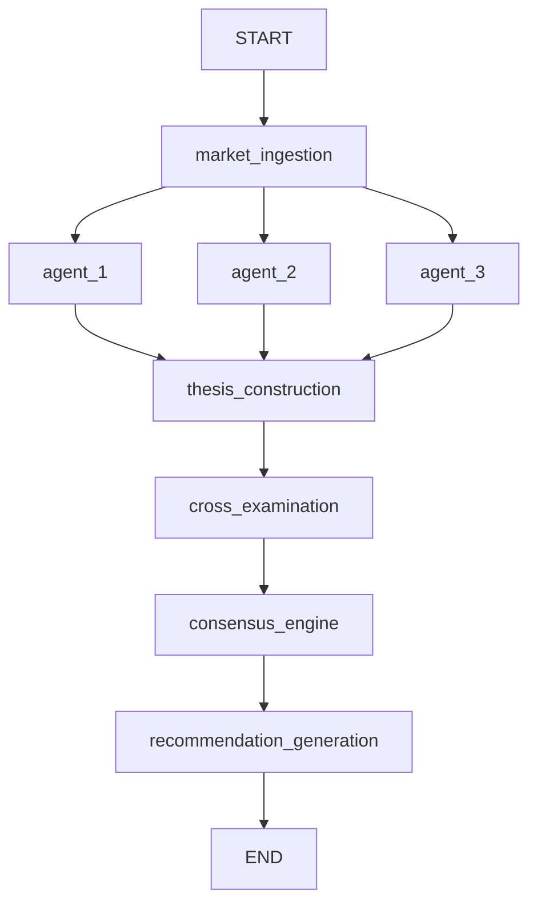

# Usage Examples

Practical examples for using the Market Intelligence Engine.

## Table of Contents

- [Basic Usage](#basic-usage)
- [CLI Examples](#cli-examples)
- [Programmatic Usage](#programmatic-usage)
- [Configuration Examples](#configuration-examples)
- [Advanced Usage](#advanced-usage)
- [Integration Examples](#integration-examples)

## Basic Usage

### Analyze a Single Market

The simplest way to analyze a market:

```bash
npm run cli -- analyze 0x1234567890abcdef
```

**Output:**

```
═══════════════════════════════════════════════════════════════
TRADE RECOMMENDATION
═══════════════════════════════════════════════════════════════

Action: LONG_YES
Expected Value: $12.50 per $100 invested
Win Probability: 62%
Entry Zone: $0.48 - $0.52
Target Zone: $0.60 - $0.65
Liquidity Risk: Low

───────────────────────────────────────────────────────────────
EXPLANATION
───────────────────────────────────────────────────────────────

Summary: Market is underpricing the probability of this outcome
based on strong fundamental catalysts and favorable risk/reward.

Core Thesis: Three major catalysts converge in Q2 2024, creating
a high-probability path to YES resolution.

Key Catalysts:
• Policy announcement expected March 15, 2024
• Historical precedent shows 75% success rate
• Market sentiment shifting based on recent data

Failure Scenarios:
• Unexpected regulatory intervention
• External economic shock disrupting timeline
• Key stakeholder opposition emerges

───────────────────────────────────────────────────────────────
METADATA
───────────────────────────────────────────────────────────────

Market Probability: 50%
Consensus Probability: 62%
Edge: 12%
Confidence Band: [58%, 66%]
```

### Analyze with Debug Information

View detailed execution information:

```bash
npm run cli -- analyze 0x1234567890abcdef --debug
```

**Additional Output:**

```
───────────────────────────────────────────────────────────────
DEBUG INFORMATION
───────────────────────────────────────────────────────────────

Configuration:
• LLM Mode: Multi-provider
• Checkpointer: sqlite
• Opik Tracking: Enabled

Agent Signals:
• Market Microstructure: 0.58 (confidence: 0.75)
  - Key drivers: Order book depth, momentum
• Probability Baseline: 0.65 (confidence: 0.80)
  - Key drivers: Historical data, base rates
• Risk Assessment: 0.60 (confidence: 0.70)
  - Key drivers: Tail risks, failure modes

Debate Scores:
• Bull Thesis: 7.5/10
• Bear Thesis: 4.2/10

Consensus Details:
• Disagreement Index: 0.08 (low)
• Regime: High-confidence
• Contributing Agents: 3/3
```

## CLI Examples

### Budget-Friendly Analysis

Use single-provider mode with a budget model:

```bash
npm run cli -- analyze 0x1234567890abcdef \
  --single-provider openai \
  --model gpt-4o-mini
```

**Cost:** ~$0.01 per analysis

### High-Quality Analysis

Use multi-provider mode with premium models (default):

```bash
npm run cli -- analyze 0x1234567890abcdef --debug
```

**Cost:** ~$0.08 per analysis

### With Visualization

Generate a Mermaid diagram of the workflow:

```bash
npm run cli -- analyze 0x1234567890abcdef --visualize
```

**Output includes:**



### With Cost Tracking

View LLM costs for the analysis:

```bash
npm run cli -- analyze 0x1234567890abcdef --show-costs
```

**Additional Output:**

```
───────────────────────────────────────────────────────────────
COST BREAKDOWN
───────────────────────────────────────────────────────────────

Total Cost: $0.085

By Agent:
• Market Microstructure (GPT-4-turbo): $0.050
• Probability Baseline (Gemini-1.5-flash): $0.002
• Risk Assessment (Claude-3-sonnet): $0.030
• Thesis Construction: $0.003

By Provider:
• OpenAI: $0.053
• Anthropic: $0.030
• Google: $0.002

Token Usage:
• Input: 4,250 tokens
• Output: 1,820 tokens
• Total: 6,070 tokens
```

### With Opik Trace

Get a link to the Opik trace for detailed inspection:

```bash
npm run cli -- analyze 0x1234567890abcdef --opik-trace
```

**Additional Output:**

```
───────────────────────────────────────────────────────────────
OPIK TRACE
───────────────────────────────────────────────────────────────

View detailed trace at:
https://www.comet.com/opik/traces/abc123def456

Trace includes:
• Complete execution timeline
• All LLM calls with prompts/responses
• Graph visualization
• Cost breakdown
• State at each checkpoint
```

### Query Historical Analyses

View all past analyses for a market:

```bash
npm run cli -- history 0x1234567890abcdef
```

**Output:**

```
═══════════════════════════════════════════════════════════════
HISTORICAL ANALYSES
═══════════════════════════════════════════════════════════════

Market: 0x1234567890abcdef

Analysis 1:
• Date: 2024-01-15 10:30:00
• Action: LONG_YES
• Expected Value: $12.50
• Cost: $0.085
• Duration: 12.5s

Analysis 2:
• Date: 2024-01-14 15:45:00
• Action: NO_TRADE
• Reason: Insufficient edge (3%)
• Cost: $0.082
• Duration: 11.8s

Analysis 3:
• Date: 2024-01-13 09:15:00
• Action: LONG_NO
• Expected Value: $8.20
• Cost: $0.088
• Duration: 13.2s
```

## Programmatic Usage

### Basic Analysis

```typescript
import { analyzeMarket } from './src/workflow';

async function main() {
  const conditionId = '0x1234567890abcdef';
  
  try {
    const result = await analyzeMarket(conditionId);
    
    console.log('Action:', result.recommendation.action);
    console.log('Expected Value:', result.recommendation.expectedValue);
    console.log('Win Probability:', result.recommendation.winProbability);
    console.log('Explanation:', result.recommendation.explanation.summary);
  } catch (error) {
    console.error('Analysis failed:', error);
  }
}

main();
```

### Batch Analysis

Analyze multiple markets in parallel:

```typescript
import { analyzeMarket } from './src/workflow';

async function analyzeMultipleMarkets(conditionIds: string[]) {
  const results = await Promise.allSettled(
    conditionIds.map(id => analyzeMarket(id))
  );
  
  results.forEach((result, index) => {
    if (result.status === 'fulfilled') {
      const rec = result.value.recommendation;
      console.log(`Market ${conditionIds[index]}:`, rec.action);
    } else {
      console.error(`Market ${conditionIds[index]} failed:`, result.reason);
    }
  });
}

const markets = [
  '0x1234567890abcdef',
  '0xabcdef1234567890',
  '0x9876543210fedcba'
];

analyzeMultipleMarkets(markets);
```

### With Custom Configuration

Override default configuration:

```typescript
import { analyzeMarket } from './src/workflow';
import { loadConfig } from './src/config';

async function analyzeWithCustomConfig(conditionId: string) {
  // Load and override config
  const config = loadConfig();
  config.consensus.minEdgeThreshold = 0.08;  // Require 8% edge
  config.agents.minAgentsRequired = 3;       // Require all agents
  
  const result = await analyzeMarket(conditionId, config);
  return result;
}
```

### Error Handling

Robust error handling:

```typescript
import { analyzeMarket } from './src/workflow';

async function analyzeWithErrorHandling(conditionId: string) {
  try {
    const result = await analyzeMarket(conditionId);
    
    // Check for errors in result
    if (result.ingestionError) {
      console.error('Ingestion failed:', result.ingestionError);
      return null;
    }
    
    if (result.agentErrors.length > 0) {
      console.warn('Some agents failed:', result.agentErrors);
    }
    
    if (result.consensusError) {
      console.error('Consensus failed:', result.consensusError);
      return null;
    }
    
    return result.recommendation;
  } catch (error) {
    if (error.message.includes('rate limit')) {
      console.error('Rate limit exceeded, retry later');
    } else if (error.message.includes('API key')) {
      console.error('Invalid API key');
    } else {
      console.error('Unknown error:', error);
    }
    return null;
  }
}
```

### Streaming Results

Stream results as they become available:

```typescript
import { workflow } from './src/workflow';

async function analyzeWithStreaming(conditionId: string) {
  const stream = await workflow.stream(
    { conditionId },
    { 
      configurable: { thread_id: conditionId },
      streamMode: 'updates'
    }
  );
  
  for await (const update of stream) {
    console.log('Update:', update);
    
    // Process updates as they arrive
    if (update.agentSignals) {
      console.log('Agent completed:', update.agentSignals);
    }
    
    if (update.recommendation) {
      console.log('Final recommendation:', update.recommendation);
    }
  }
}
```

## Configuration Examples

### Single-Provider Mode (OpenAI)

```bash
# .env
LLM_SINGLE_PROVIDER=openai
OPENAI_API_KEY=sk-...
OPENAI_DEFAULT_MODEL=gpt-4o-mini

# Other settings
OPIK_API_KEY=...
LANGGRAPH_CHECKPOINTER=sqlite
```

### Single-Provider Mode (Anthropic)

```bash
# .env
LLM_SINGLE_PROVIDER=anthropic
ANTHROPIC_API_KEY=sk-ant-...
ANTHROPIC_DEFAULT_MODEL=claude-3-haiku-20240307

# Other settings
OPIK_API_KEY=...
LANGGRAPH_CHECKPOINTER=sqlite
```

### Single-Provider Mode (Google)

```bash
# .env
LLM_SINGLE_PROVIDER=google
GOOGLE_API_KEY=AIza...
GOOGLE_DEFAULT_MODEL=gemini-1.5-flash

# Other settings
OPIK_API_KEY=...
LANGGRAPH_CHECKPOINTER=sqlite
```

### Multi-Provider Mode (Default)

```bash
# .env
# Leave LLM_SINGLE_PROVIDER unset

# Configure all providers
OPENAI_API_KEY=sk-...
OPENAI_DEFAULT_MODEL=gpt-4-turbo

ANTHROPIC_API_KEY=sk-ant-...
ANTHROPIC_DEFAULT_MODEL=claude-3-sonnet-20240229

GOOGLE_API_KEY=AIza...
GOOGLE_DEFAULT_MODEL=gemini-1.5-flash

# Other settings
OPIK_API_KEY=...
LANGGRAPH_CHECKPOINTER=sqlite
```

### Development Configuration

```bash
# .env.development
NODE_ENV=development
LOG_LEVEL=debug

# Use single-provider with budget model
LLM_SINGLE_PROVIDER=openai
OPENAI_API_KEY=sk-...
OPENAI_DEFAULT_MODEL=gpt-4o-mini

# In-memory checkpointing
LANGGRAPH_CHECKPOINTER=memory

# Opik (optional for dev)
OPIK_API_KEY=...
OPIK_PROJECT_NAME=market-intelligence-engine-dev
```

### Production Configuration

```bash
# .env.production
NODE_ENV=production
LOG_LEVEL=info

# Use multi-provider for quality
OPENAI_API_KEY=sk-...
OPENAI_DEFAULT_MODEL=gpt-4-turbo

ANTHROPIC_API_KEY=sk-ant-...
ANTHROPIC_DEFAULT_MODEL=claude-3-sonnet-20240229

GOOGLE_API_KEY=AIza...
GOOGLE_DEFAULT_MODEL=gemini-1.5-flash

# Persistent checkpointing
LANGGRAPH_CHECKPOINTER=sqlite

# Opik for observability
OPIK_API_KEY=...
OPIK_PROJECT_NAME=market-intelligence-engine-prod
OPIK_TRACK_COSTS=true

# Audit trail
AUDIT_TRAIL_RETENTION_DAYS=90
```

## Advanced Usage

### Custom Agent Configuration

Create custom agent configurations:

```typescript
import { createAgentNode, createLLMInstances } from './src/nodes/agents';
import { ChatOpenAI } from '@langchain/openai';

// Create custom LLM instance
const customLLM = new ChatOpenAI({
  apiKey: process.env.OPENAI_API_KEY,
  model: 'gpt-4-turbo',
  temperature: 0.7,  // Custom temperature
  maxTokens: 2000    // Custom max tokens
});

// Create custom agent
const customAgent = createAgentNode(
  'custom_agent',
  customLLM,
  'You are a custom agent with specific instructions...'
);
```

### Custom Workflow

Build a custom workflow with additional nodes:

```typescript
import { StateGraph, END } from '@langchain/langgraph';
import { GraphState } from './src/models/state';

const customWorkflow = new StateGraph(GraphState)
  .addNode('market_ingestion', marketIngestionNode)
  .addNode('custom_preprocessing', customPreprocessingNode)
  .addNode('agent_1', agent1Node)
  .addNode('agent_2', agent2Node)
  .addNode('custom_postprocessing', customPostprocessingNode)
  .addNode('recommendation', recommendationNode)
  
  .addEdge('__start__', 'market_ingestion')
  .addEdge('market_ingestion', 'custom_preprocessing')
  .addEdge('custom_preprocessing', 'agent_1')
  .addEdge('custom_preprocessing', 'agent_2')
  .addEdge('agent_1', 'custom_postprocessing')
  .addEdge('agent_2', 'custom_postprocessing')
  .addEdge('custom_postprocessing', 'recommendation')
  .addEdge('recommendation', END);

const app = customWorkflow.compile();
```

### Caching Results

Implement caching for frequently analyzed markets:

```typescript
import { analyzeMarket } from './src/workflow';

const cache = new Map<string, { result: any, timestamp: number }>();
const CACHE_TTL = 5 * 60 * 1000;  // 5 minutes

async function analyzeWithCache(conditionId: string) {
  // Check cache
  const cached = cache.get(conditionId);
  if (cached && Date.now() - cached.timestamp < CACHE_TTL) {
    console.log('Returning cached result');
    return cached.result;
  }
  
  // Analyze
  const result = await analyzeMarket(conditionId);
  
  // Cache result
  cache.set(conditionId, {
    result,
    timestamp: Date.now()
  });
  
  return result;
}
```

### Rate Limiting

Implement rate limiting for API calls:

```typescript
import { analyzeMarket } from './src/workflow';

class RateLimiter {
  private queue: Array<() => Promise<any>> = [];
  private processing = false;
  private requestsPerMinute = 10;
  private interval = 60000;  // 1 minute
  
  async add<T>(fn: () => Promise<T>): Promise<T> {
    return new Promise((resolve, reject) => {
      this.queue.push(async () => {
        try {
          const result = await fn();
          resolve(result);
        } catch (error) {
          reject(error);
        }
      });
      
      this.process();
    });
  }
  
  private async process() {
    if (this.processing || this.queue.length === 0) return;
    
    this.processing = true;
    
    while (this.queue.length > 0) {
      const fn = this.queue.shift()!;
      await fn();
      await this.delay(this.interval / this.requestsPerMinute);
    }
    
    this.processing = false;
  }
  
  private delay(ms: number) {
    return new Promise(resolve => setTimeout(resolve, ms));
  }
}

const rateLimiter = new RateLimiter();

async function analyzeWithRateLimit(conditionId: string) {
  return rateLimiter.add(() => analyzeMarket(conditionId));
}
```

## Integration Examples

### Express.js API

Create a REST API for market analysis:

```typescript
import express from 'express';
import { analyzeMarket } from './src/workflow';

const app = express();
app.use(express.json());

app.post('/api/analyze', async (req, res) => {
  const { conditionId } = req.body;
  
  if (!conditionId) {
    return res.status(400).json({ error: 'conditionId required' });
  }
  
  try {
    const result = await analyzeMarket(conditionId);
    res.json(result.recommendation);
  } catch (error) {
    res.status(500).json({ error: error.message });
  }
});

app.get('/api/history/:conditionId', async (req, res) => {
  const { conditionId } = req.params;
  
  // Query Opik for historical analyses
  const history = await getHistoricalAnalyses(conditionId);
  res.json(history);
});

app.listen(3000, () => {
  console.log('API listening on port 3000');
});
```

### WebSocket Streaming

Stream analysis results in real-time:

```typescript
import { WebSocketServer } from 'ws';
import { workflow } from './src/workflow';

const wss = new WebSocketServer({ port: 8080 });

wss.on('connection', (ws) => {
  ws.on('message', async (message) => {
    const { conditionId } = JSON.parse(message.toString());
    
    const stream = await workflow.stream(
      { conditionId },
      { 
        configurable: { thread_id: conditionId },
        streamMode: 'updates'
      }
    );
    
    for await (const update of stream) {
      ws.send(JSON.stringify(update));
    }
    
    ws.send(JSON.stringify({ type: 'complete' }));
  });
});
```

### Queue-Based Processing

Process analyses using a queue:

```typescript
import Bull from 'bull';
import { analyzeMarket } from './src/workflow';

const analysisQueue = new Bull('market-analysis', {
  redis: { host: 'localhost', port: 6379 }
});

// Add job to queue
async function queueAnalysis(conditionId: string) {
  await analysisQueue.add({ conditionId });
}

// Process jobs
analysisQueue.process(async (job) => {
  const { conditionId } = job.data;
  const result = await analyzeMarket(conditionId);
  return result.recommendation;
});

// Handle completion
analysisQueue.on('completed', (job, result) => {
  console.log(`Analysis completed for ${job.data.conditionId}:`, result);
});

// Handle failure
analysisQueue.on('failed', (job, error) => {
  console.error(`Analysis failed for ${job.data.conditionId}:`, error);
});
```

## Support

For more examples and help:
- Check [Main README](../README.md)
- Review [CLI Documentation](../CLI.md)
- See [API Documentation](./API.md)
- Join our community

---

**Last Updated:** January 2026
